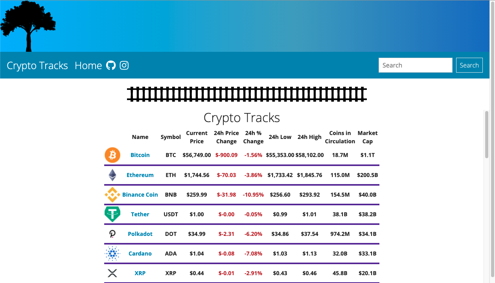

</img>

## Crypto Tracks // React 

### Description

A crypto-coin tracking website that uses the coingecko API.  Graphs are made using react-vis.  All data is live and updated when the user visits the site.  Uses Promise.all to make sure multiple API requests are all displayed in the correct order, regardless of how long it takes to get back the data requested.

### Technologies

React

### Check it out

https://jakescudder.github.io/Crypto-Tracks/#/
